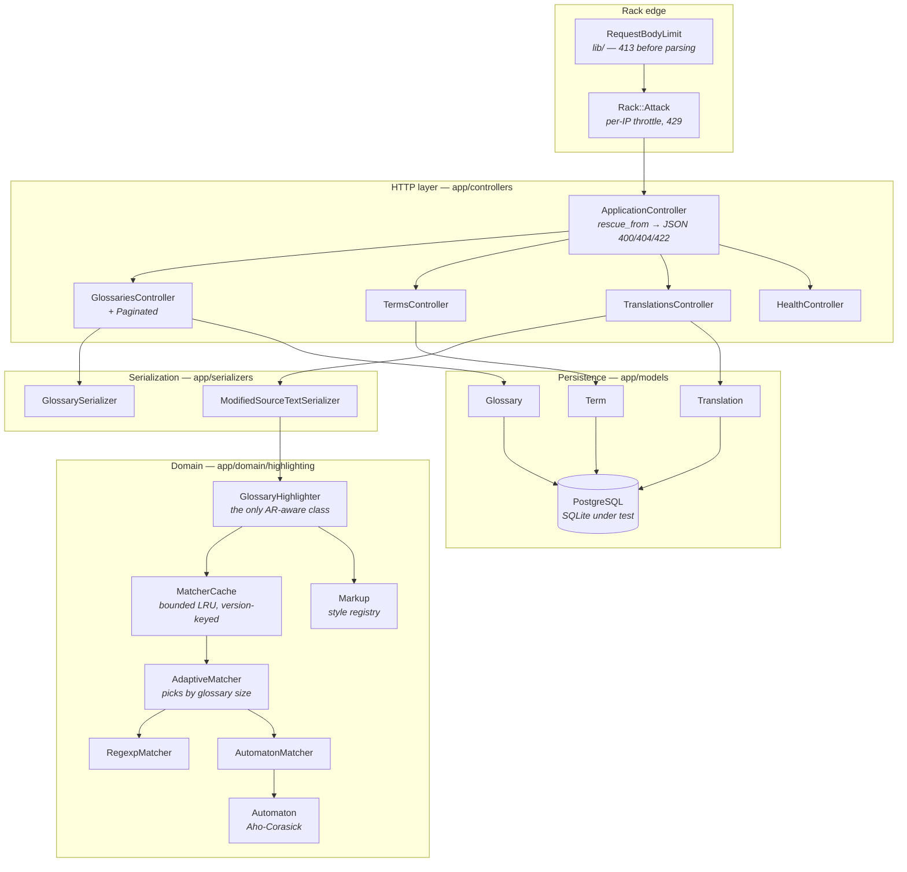
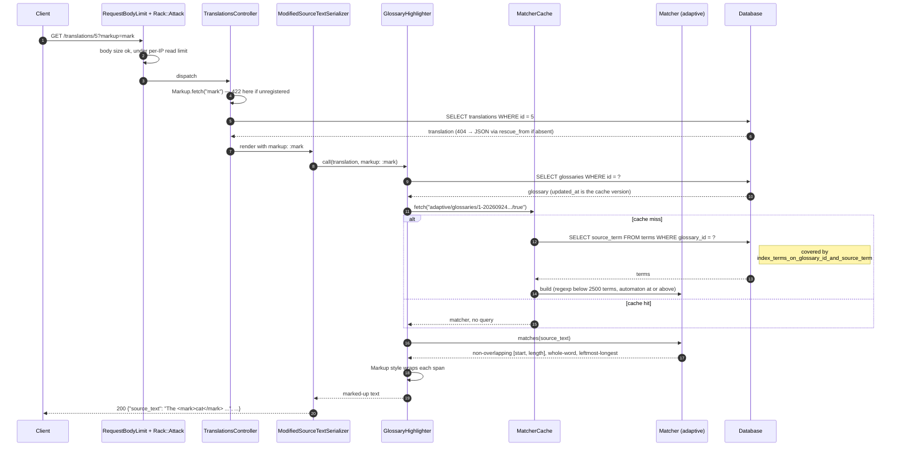

# Translator API

A JSON API for **glossary-aware text markup**. You register a glossary — a language pair
plus a list of terms — attach it to a piece of source text, and reading that text back
returns it with every whole-word occurrence of a glossary term wrapped in markers.

Despite the name, **it performs no machine translation and calls no external provider.**
Matching and markup happen locally, in `app/domain/highlighting/`. There are no API keys to
configure; the only thing the service needs is a database. A spec stubs `Net::HTTP` to raise
so that any outbound call introduced later fails the suite loudly.

Jump to the [API reference](#api-reference) for the endpoint list.

## Captured output

There is no UI. The blocks below are excerpts from
[`docs/api-session.md`](docs/api-session.md), a full session recorded against a locally
running instance; [`docs/benchmark.txt`](docs/benchmark.txt) and
[`docs/test-run.txt`](docs/test-run.txt) hold the rest.

Highlighting, three ways. Terms are matched whole-word and longest-first, so `dogged` and
`concatenation` are left alone even though `dog` and `cat` are glossary terms:

```console
$ curl -X POST http://localhost:8380/translations -H 'Content-Type: application/json' -d '{"translation":{"source_language_code":"en","target_language_code":"fr","glossary_id":1,"source_text":"The cat ate ice cream in New York, and the dogged concatenation stayed put."}}'
HTTP 201
{
  "id": 5,
  "source_language_code": "en",
  "target_language_code": "fr",
  "source_text": "The cat ate ice cream in New York, and the dogged concatenation stayed put.",
  "glossary_id": 1
}

$ curl http://localhost:8380/translations/5
HTTP 200
{
  "id": 5,
  "source_language_code": "en",
  "target_language_code": "fr",
  "source_text": "The <HIGHLIGHT>cat</HIGHLIGHT> ate <HIGHLIGHT>ice cream</HIGHLIGHT> in <HIGHLIGHT>New York</HIGHLIGHT>, and the dogged concatenation stayed put.",
  "glossary_id": 1
}

$ curl 'http://localhost:8380/translations/5?markup=mark'
HTTP 200
{
  "id": 5,
  "source_language_code": "en",
  "target_language_code": "fr",
  "source_text": "The <mark>cat</mark> ate <mark>ice cream</mark> in <mark>New York</mark>, and the dogged concatenation stayed put.",
  "glossary_id": 1
}
```

A glossary can be case-insensitive; the original casing of the text is preserved:

```console
$ curl http://localhost:8380/translations/2
HTTP 200
{
  "id": 2,
  "source_language_code": "en",
  "target_language_code": "de",
  "source_text": "A <HIGHLIGHT>Cat</HIGHLIGHT>, a <HIGHLIGHT>DOG</HIGHLIGHT> and the <HIGHLIGHT>release notes</HIGHLIGHT> are in the <HIGHLIGHT>pull request</HIGHLIGHT>.",
  "glossary_id": 2
}
```

Oversized bodies are refused before Rails parses them, and reads are throttled per IP:

```console
$ { printf '{"translation":{"source_text":"'; head -c 2000000 /dev/zero | tr '\0' 'a'; printf '"}}'; } > /tmp/big.json
$ wc -c < /tmp/big.json
2000034
$ curl -sS -w '\n%{http_code}\n' -X POST http://localhost:8380/translations -H 'Content-Type: application/json' --data-binary @/tmp/big.json
{"errors":"Request body too large (limit 1048576 bytes)"}
413

# A burst of 125 reads against the 120-per-minute budget: 109 answered 200 and
# 16 answered 429, the earlier requests of this session having already spent
# part of the window. The status-by-status run is in docs/api-session.md.
$ curl -sS -D - -o /dev/null http://localhost:8380/glossaries | head -1
HTTP/1.1 429 Too Many Requests
$ curl -sS http://localhost:8380/glossaries
{"errors":"Rate limit exceeded. Retry in 60 seconds."}
$ curl -sS -o /dev/null -w '%{http_code}\n' http://localhost:8380/health   # health checks are safelisted
200
```

The suite and the linter:

```console
$ bundle exec rspec
................................................................................................................................................................................................................................................................

Finished in 1.17 seconds (files took 1.33 seconds to load)
256 examples, 0 failures

$ bundle exec standardrb
(no output: no offenses)
```

## Architecture

The application is a thin HTTP layer over a plain-Ruby domain. Controllers parse and
render; models own persistence and validation; everything about *matching and marking up
text* lives in the `Highlighting` namespace, which knows nothing about HTTP and — apart
from one adapter class — nothing about ActiveRecord. That is what makes the matcher
benchmarkable and exhaustively testable without a database.

Dependencies point inward: `Highlighting::GlossaryHighlighter` is the only part of the
domain that touches ActiveRecord, and nothing in the domain refers to a controller,
a serializer or a request.



## Request flow

`GET /translations/:id` is the path that does real work. Everything else is CRUD.



## Quickstart

### Docker

One command, no manual steps. Postgres and the API start together and the database is
created, migrated and seeded on first boot.

```bash
docker compose up --build
```

The API is then on <http://localhost:8380> with three glossaries, twelve terms and four
translations already loaded:

```bash
curl http://localhost:8380/health
curl http://localhost:8380/glossaries
curl http://localhost:8380/translations/1
```

Tear down with `docker compose down -v`.

Host ports are **8380** (API) and **8381** (Postgres), chosen to stay clear of the usual
defaults. Inside the compose network the app talks to Postgres on 5432 as normal.

### Local

```bash
bin/setup                 # bundle install, db:prepare, db:seed
bin/rails server          # http://localhost:3000
```

`bin/setup` needs a reachable PostgreSQL; point it at one with the `DATABASE_*` variables
below. The **test** suite needs no database server at all — see
[Development](#development).

## Configuration

Every variable the application reads. None is required for the test suite, and none is an
API key: there is no third-party service.

| Variable | Required | Default | What it does |
| --- | --- | --- | --- |
| `DATABASE_NAME` | no | `translator_api_development` (dev), `translator_api_production` (prod) | Postgres database name |
| `DATABASE_USERNAME` | no | unset — libpq falls back to the OS user | Postgres user |
| `DATABASE_PASSWORD` | no | unset | Postgres password |
| `DATABASE_HOST` | no | unset — libpq falls back to the local socket | Postgres host |
| `DATABASE_PORT` | no | `5432` | Postgres port |
| `SECRET_KEY_BASE` | **yes in production** | unset | Rails signing key. `docker-compose.yml` supplies a throwaway value; replace it for a real deployment |
| `RAILS_ENV` | no | `development` | Rails environment |
| `PORT` | no | `3000` | Port Puma binds to |
| `RAILS_MAX_THREADS` | no | `5` | Puma max threads **and** the Active Record pool size |
| `RAILS_MIN_THREADS` | no | `RAILS_MAX_THREADS` | Puma min threads |
| `WEB_CONCURRENCY` | no | `0` (single mode) | Puma forked workers; `preload_app!` is enabled when above zero |
| `PIDFILE` | no | `tmp/pids/server.pid` | Puma pidfile |
| `MAX_REQUEST_BODY_BYTES` | no | `1048576` (1 MiB) | Bodies above this get `413` before Rails parses them |
| `RATE_LIMIT_READS_PER_MINUTE` | no | `120` | Per-IP GET budget |
| `RATE_LIMIT_WRITES_PER_MINUTE` | no | `30` | Per-IP POST/PUT/PATCH/DELETE budget |
| `HIGHLIGHT_AUTOMATON_THRESHOLD` | no | `2500` | Term count at which the adaptive matcher switches from the regexp scanner to the automaton |
| `RAILS_LOG_TO_STDOUT` | no | unset | Log to stdout in production (set in the image) |
| `RAILS_LOG_LEVEL` | no | `info` | Production log level |
| `RAILS_FORCE_SSL` | no | unset | Redirect to HTTPS and set HSTS in production |
| `RAILS_SERVE_STATIC_FILES` | no | unset | Serve `public/` from the app in production |
| `SKIP_DB_SETUP` | no | unset | Set to `1` to stop `entrypoint.sh` running `db:prepare` and `db:seed` |
| `CI` | no | unset | Eager loads the app in the test environment |

As an alternative to exporting variables, `config/environment.rb` loads an untracked
`config/environment_variables.yml` at boot if it exists, keyed by Rails environment. A
missing file or a missing key is simply ignored. The file is in `.gitignore`; do not commit
credentials.

```yaml
development:
  DATABASE_NAME: translator_api_development
  DATABASE_USERNAME: postgres
  DATABASE_PASSWORD: postgres
  DATABASE_HOST: localhost
```

## Development

Ruby 3.1.3 (see `.ruby-version`) and Bundler. PostgreSQL is needed to *run* the app, but
not to test it.

```bash
bundle install

bundle exec rspec                       # whole suite — SQLite, no server needed
bundle exec rspec spec/domain           # the matching engine alone
bundle exec standardrb                  # lint
bundle exec standardrb --fix            # lint and autocorrect

bundle exec rake benchmark:highlighting # the numbers quoted in Design notes
```

The test environment uses SQLite (`config/database.yml`), which is what lets the suite run
in CI with no service container. `spec/environment/database_adapter_spec.rb` fails if that
is changed without the setup instructions changing with it.

`.github/workflows/ci.yml` runs the linter and the suite on every push and pull request,
with `CI=true` so the app is eager loaded and a constant that only resolves lazily fails
there rather than in production.

To run the app locally against PostgreSQL:

```bash
export DATABASE_NAME=translator_api_development DATABASE_HOST=localhost
bin/rails db:prepare db:seed
bin/rails server
```

## Project structure

```
app/
  controllers/
    application_controller.rb      rescue_from → one JSON error shape for 400/404/422
    concerns/paginated.rb          bounded index endpoints; paging metadata in headers
    glossaries_controller.rb       index / show / create
    terms_controller.rb            create, nested under a glossary
    translations_controller.rb     create / show; resolves the ?markup= style
    health_controller.rb           GET /health, used by the container healthcheck
  domain/
    highlighting.rb                namespace + matching-strategy registry
    highlighting/
      matcher.rb                   strategy base: folding, word boundaries,
                                   leftmost-longest resolution
      regexp_matcher.rb            alternation of literals, scanned by Onigmo
      automaton_matcher.rb         single-pass scan over the automaton
      automaton.rb                 Aho-Corasick, keyed by code point
      adaptive_matcher.rb          picks a strategy from the glossary's size
      matcher_cache.rb             bounded LRU, keyed by glossary cache version
      markup.rb                    registry of marker pairs (the extension point)
      glossary_highlighter.rb      the one ActiveRecord-aware class in the domain
  models/                          Glossary, Term, Translation + validations
  serializers/                     AMS serializers; the highlighting one only delegates
config/
  routes.rb                        only the actions that exist are routed
  database.yml                     Postgres for dev/prod, SQLite for test
  environment.rb                   optional config/environment_variables.yml loader
  initializers/
    rack_attack.rb                 per-IP throttles, /health safelisted
    wrap_parameters.rb             parameter wrapping deliberately disabled
db/
  migrate/                         tables, then the integrity and case-sensitivity changes
  schema.rb                        dumped from PostgreSQL
  seeds.rb                         idempotent; three glossaries, twelve terms
lib/
  request_body_limit.rb            Rack middleware, 413 before parsing
  highlighting_benchmark.rb        the benchmark behind the Design notes
  tasks/benchmark.rake
spec/
  domain/                          the matching engine, including strategy parity
  lib/                             the body-limit middleware
  models/                          validations, associations, database constraints
  requests/                        every endpoint, plus pagination, throttling,
                                   body limits and query counts
  routing/                         asserts unimplemented actions are not routed
  serializers/                     the highlighting serializer's public payload
  environment/                     asserts the test adapter stays SQLite
  factories/                       FactoryBot definitions
  support/                         query counter, cache reset, Rack::Attack toggle
docs/                              captured session, benchmark and test output
```

## Design notes

### Where the logic lives

The matching logic used to sit inside an ActiveModel serializer, which meant it could only
be exercised through a serializer with a persisted record attached. It now lives in
`Highlighting`, a namespace of plain Ruby objects. `Highlighting::Matcher` takes an array
of strings and returns character offsets; `Highlighting::Markup` turns offsets into marked-up
text; `Highlighting::GlossaryHighlighter` is the single adapter that reads a `Translation`
and its `Glossary`. The serializer is four lines and delegates.

That split is what makes `rake benchmark:highlighting` possible at all — it drives the
matcher directly, with no database and no HTTP.

Matching semantics, all covered by specs:

- **Whole-word only.** A term matches when the characters on either side are not word
  characters, so `cat` does not fire inside `concatenation`.
- **Leftmost-longest.** With both `New` and `New York` in the glossary, `New York` wins and
  the shorter term cannot split the span.
- **Literal, never a pattern.** A term containing `5$` or `(` matches those characters.
- **Case sensitivity is per glossary.** `glossaries.case_sensitive` defaults to `true`, so
  existing glossaries behave exactly as before. When it is false, folding is done in a way
  that cannot shift character offsets: a code point is only folded when its lowercase form
  is a single character, because a few (U+0130, for one) lowercase to two and would move
  every offset after them.
- **The text is never mutated.** Rendering is a pure function of the stored row.

### Scalability: what the bottleneck actually was

The original implementation called `Regexp.union` over every glossary term and interpolated
it into a fresh `Regexp` **on every read**. Matching itself was never the problem; rebuilding
the matcher on each request was. `rake benchmark:highlighting` measures it — full output in
[`docs/benchmark.txt`](docs/benchmark.txt):

```
Ruby 3.1.3 | arm64-darwin23 | 2026-09-24 02:13:05Z
Each figure is the mean of as many calls as fit in 0.5s.
Adaptive threshold: 2500 terms.

As shipped: default strategy, one 5000-character text (ms/call)
terms         picks       rebuild         cached          saved
10            regexp      0.268           0.228           1.2x
100           regexp      0.398           0.244           1.6x
1000          regexp      2.045           0.431           4.7x
5000          automaton   8.951           0.935           9.6x
```

So the fix is a cache, not a cleverer scanner: `Highlighting::MatcherCache` is a bounded,
process-local LRU keyed by `glossary.cache_key_with_version`. `Term belongs_to :glossary,
touch: true` bumps that version whenever a term is created, updated or destroyed, so a
compiled matcher is never stale — there are specs for each of those three cases.

The scanner question is a separate one, and the measurement contradicted the obvious answer.
An Aho-Corasick automaton scans in a single pass, so its cost is flat in the number of terms,
but Onigmo does alternation scanning in C while the automaton is pure Ruby:

```
Warm: matcher already built, highlight one 5000-character text (ms/call)
terms         automaton       regexp          speedup
10            0.733           0.225           0.3x
100           0.808           0.265           0.3x
1000          0.881           0.386           0.4x
5000          0.933           1.340           1.4x
```

The automaton is flat, as advertised — and three times *slower* than the regexp until the
glossary has thousands of terms. Defaulting to it on asymptotics alone would have made every
realistic request slower. `Highlighting::AdaptiveMatcher` therefore picks per glossary, with
the crossover at `HIGHLIGHT_AUTOMATON_THRESHOLD` (2500). Both strategies stay in the tree and
a spec asserts they agree character-for-character, including on a few hundred randomly
generated term/text pairs, so the fast path cannot silently drift from the reference one.

The rest of the scalability work:

- **Queries.** `GET /glossaries` eager loads terms; a spec asserts the query count does not
  grow with the number of glossaries. `GET /translations/:id` deliberately does *not* eager
  load — terms are only read when the matcher cache misses, so a warm read is two queries
  whatever the glossary size, and a spec asserts that too.
- **Indexes.** A unique index on `(source_language_code, target_language_code)`, a composite
  `(glossary_id, source_term)` on terms that covers the only query the highlighter makes, and
  the now-redundant single-column index on `terms.glossary_id` dropped.
- **Integrity in the database, not only in the model.** A foreign key on
  `translations.glossary_id` with `ON DELETE SET NULL`, so a dangling reference cannot be
  written by a bulk import or a console session. `spec/models/database_constraints_spec.rb`
  inserts behind the validations to prove it.
- **Bounded reads.** `GET /glossaries` is paginated, default 25, hard maximum 100. The body
  stays a plain JSON array and the paging metadata travels in `X-Page`, `X-Per-Page`,
  `X-Total-Count` and `X-Total-Pages`, so no existing client breaks.
- **Bounded writes.** `RequestBodyLimit` answers `413` from `Content-Length`, and wraps
  `rack.input` so a chunked body that declares no length is stopped mid-stream.
- **Throttling.** Rack::Attack, separate budgets for reads and writes, `/health` safelisted.

### Extensibility

The seam is `Highlighting::Markup`, a registry of marker pairs. Three are registered
(`highlight`, `mark`, `brackets`) and `GET /translations/:id?markup=…` selects one; an
unregistered name returns `422` listing the registered ones. Adding a fourth — XLIFF `<mrk>`
tags, say — is one line in an initializer and needs no change to the matcher, the controller
or the serializer:

```ruby
Highlighting::Markup.register(:xliff, open: "<mrk>", close: "</mrk>")
```

The matching-strategy registry behind `Highlighting.register_strategy` is the same idea one
layer down. It is load-bearing rather than speculative: it has two real implementations plus
the adaptive selector that chooses between them, and it is how the benchmark and the parity
spec get hold of both.

### Deliberately not done

**No AI, and no machine translation.** This service stores text and marks up glossary terms;
adding a model call would change what it *is*, introduce a key to manage, a failure mode to
degrade from, and an outbound call that the existing no-network guard exists to forbid. The
honest version of "improve the translation product" here was to improve the thing it actually
does — the matching engine — and to measure it. If a provider is ever wanted, the place for
it is a new object alongside `GlossaryHighlighter`, not inside it.

### Smaller changes worth naming

- `require "rails/all"` is gone. An API-only app has no use for Action Mailer, Action Cable,
  Active Storage, Action Text, Action Mailbox or Sprockets; the empty `app/mailers`,
  `app/channels`, `app/jobs` and `app/views` directories they justified are gone with them.
- Parameter wrapping is disabled. It was silently rewrapping an unwrapped JSON body under the
  expected key, so `{"source_text": "hi"}` was accepted over JSON while the same body
  form-encoded returned `400`. Both now return `400`.
- `Glossary::ISO_639_1_CODES` was missing 18 real codes, `el` (Greek) among them. It now
  holds all 183 current ISO 639-1 codes. Deprecated codes (`bh`, `sh`, `in`, `iw`) are still
  rejected.
- Error handling moved to `rescue_from` in `ApplicationController`, so `find` and `require`
  can be used directly instead of nil-checking in every action, and every 400/404/422 has the
  same `{"errors": "..."}` shape.

## Limitations

Things this service does not do. Several are deliberate; all are honest.

- **No machine translation.** `target_term` is stored and returned, but the output only ever
  marks up the *source* term. Nothing substitutes one language for another.
- **No authentication or authorization.** Every endpoint is open. Rate limiting is per IP,
  which is the only subject available without identity.
- **Rate limits and the matcher cache are per process.** Both live in process memory, so with
  `WEB_CONCURRENCY` above one, or several hosts, each worker keeps its own. Point
  `Rack::Attack.cache.store` at Redis or Memcached before scaling out.
- **Exact matching only.** No stemming, lemmatisation, accent folding or fuzzy matching:
  `cats` does not match the term `cat`. Word boundaries use Ruby's default `\w`, which is
  ASCII-only, so boundary detection is weakest for scripts without ASCII word characters.
- **Partial CRUD.** Glossaries and terms can be created and read; neither can be updated or
  deleted over HTTP, and translations cannot be listed. Unimplemented verbs are not routed at
  all — `spec/routing/routes_spec.rb` asserts that — so they return `404`, not `500`.
- **`source_text` is capped at 5000 characters** by both the column and a validation.
- **No background jobs, no shared cache, no search.** Everything happens in the request.
- **Seed data is fictional** and exists so a fresh boot is not empty.

## API reference

| Method | Path | Purpose |
| --- | --- | --- |
| `GET` | `/health` | Liveness and readiness; `200` or `503` |
| `POST` | `/glossaries` | Create a glossary |
| `GET` | `/glossaries` | List glossaries with their terms (paginated) |
| `GET` | `/glossaries/:id` | One glossary with its terms |
| `POST` | `/glossaries/:glossary_id/terms` | Add a term to a glossary |
| `POST` | `/translations` | Store a source text |
| `GET` | `/translations/:id` | Read it back with glossary terms marked up |

Anything else is intentionally not routed.

### Errors

| Status | When | Body |
| --- | --- | --- |
| `400` | The top-level wrapper key (`glossary`, `term`, `translation`) is missing | `{"errors": "Required parameter missing: translation"}` |
| `404` | No such record | `{"errors": "Translation not found"}` |
| `413` | Request body over `MAX_REQUEST_BODY_BYTES` | `{"errors": "Request body too large (limit 1048576 bytes)"}` |
| `422` | Validation failure | The ActiveModel error hash, e.g. `{"source_language_code": ["has already been taken"]}` |
| `422` | Unregistered `markup` | `{"errors": "unknown markup \"neon\" (known: highlight, mark, brackets)"}` |
| `429` | Over the per-IP budget | `{"errors": "Rate limit exceeded. Retry in 60 seconds."}`, with `Retry-After` |
| `503` | `/health` cannot reach the database | `{"status": "degraded", "database": "unavailable", ...}` |

### Glossaries

A glossary is a language pair and a list of terms. The pair must be unique and both codes
must be in `Glossary::ISO_639_1_CODES`. `case_sensitive` is optional and defaults to `true`.

```bash
curl -X POST http://localhost:8380/glossaries \
  -H 'Content-Type: application/json' \
  -d '{"glossary": {"source_language_code": "en", "target_language_code": "fr"}}'
```

```json
{"id":1,"source_language_code":"en","target_language_code":"fr","case_sensitive":true,"terms":[]}
```

`GET /glossaries` accepts `page` (default 1) and `per_page` (default 25, maximum 100).

### Terms

`source_term` and `target_term` are both required. The glossary comes from the URL; a
`glossary_id` in the body is ignored. An unknown glossary returns `404`.

```bash
curl -X POST http://localhost:8380/glossaries/1/terms \
  -H 'Content-Type: application/json' \
  -d '{"term": {"source_term": "cat", "target_term": "chat"}}'
```

### Translations

| Parameter | Required | Notes |
| --- | --- | --- |
| `source_language_code` | yes | ISO 639-1 |
| `target_language_code` | yes | ISO 639-1 |
| `source_text` | yes | at most 5000 characters |
| `glossary_id` | no | must exist, and its language pair must match the translation's |

`POST /translations` returns the stored row verbatim. `GET /translations/:id` returns the
same fields with `source_text` marked up, and accepts `?markup=highlight|mark|brackets`
(default `highlight`). Without a glossary the text comes back unchanged.
